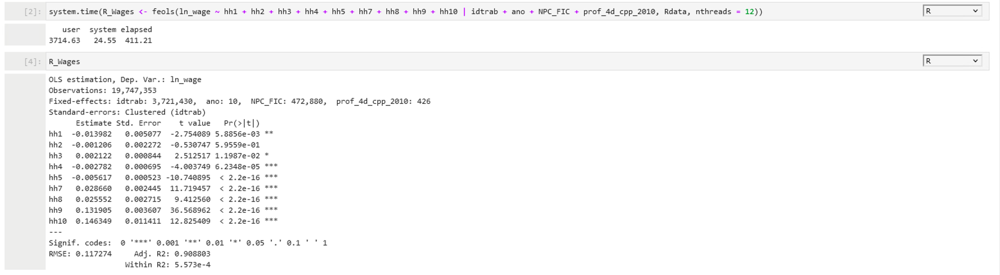

# HDFE

Show the repository on GitHub: [https://github.com/reisportela/HDFE](https://github.com/reisportela/HDFE)

1. Environments: `macOS Monterey`, `Windows Server 2019` and `Ubuntu 18.04` running on a container in MyBinder.
2. Tools: `R`, `RStudio`, `VSCode`, `Python`, `Jupyter` and `Stata 16/17`.
3. Packages:
    1. R: `fixest`, `haven`, `dplyr`, `plm`, `tictoc`, `data.table`
    2. Julia: `RData`, `DelimitedFiles`, `FixedEffectModels`, `DataFrames`, `CSV`, `RDatasets`, `ReadStat`, `StatFiles`
    3. Stata: `reghdfe`
    4. Python: `pyhdfe`
    5. Jupyter: kernels for `R`, `Julia`, `Stata`, `SoS`

The Stata files used in the exercise include: `Stata_reghdfe_Benchmark.do`, `Group Fixed Effects.ipynb`, `Basics of REGHDFE.ipynb`. The datasets are available in this repository.

### Container setup

1. The R packages that are pre-installed in the container are defined in file `environment.yml`
2. Ubuntu's packages are defined in file `apt.txt`
3. Julia's kernel defined in `Project.toml`
4. Additional OS specifications are defined in `start`

## 1. Use [MyBinder](https://mybinder.org/) to run a container with R & RStudio + Julia

Launch MyBinder with RStudio

## 2. Explore `fixest` in RStudio ecosystem

## 3. Open Visual Studio Code (locally)

> Run the Julia script `HDFE_Julia_script.jl`

## 4. Run Jupyter Lab (locally)

> and run the Julia notebook `HDFE_Julia_script.ipynb`

## 5. Use MyBinder to run the Julia Notebook

## 6. Discuss the SoS notebook: computation time using Python, R, Julia and Stata (PRJS)

> Windows server: run the notebook `All_In_One_Python_R_Julia_Stata_FULL.ipynb`

> Python is too slow: run in the sample using the notebook `HDFE_Python.ipynb` using VSCode

### The data

LEED sample: 19,747,353 observations; 3,747,353 workers; 472,880 firms; 10 years (yearly data).

### The machine

Dell server with 48 Cores & 512 GB RAM running Windows Server 2019.

### R: the state of the art

The fastest solution with an awesome ecosystem: 411.21 seconds (6.9 minutes).

### Julia: fast but lacks an adequate ecosystem

Not bad: 962.9 seconds (16.1 minutes).

### Stata: not a match for R or Julia, as far as computation time is concerned

Too slow: 5098.11 seconds (84 minutes).

### Python: just a concept

Forget it: still running.

<!--- 
## MyBinder::Just Jupyter notebook

### Notes

[https://mybinder.readthedocs.io/en/latest/using/config_files.html#start-run-code-before-the-user-sessions-starts](https://mybinder.readthedocs.io/en/latest/using/config_files.html#start-run-code-before-the-user-sessions-starts)

[https://discourse.jupyter.org/t/glibcxx-3-4-26-not-found-from-rstudio/7778/4](https://discourse.jupyter.org/t/glibcxx-3-4-26-not-found-from-rstudio/7778/4)
-->
